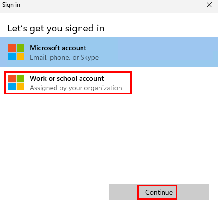
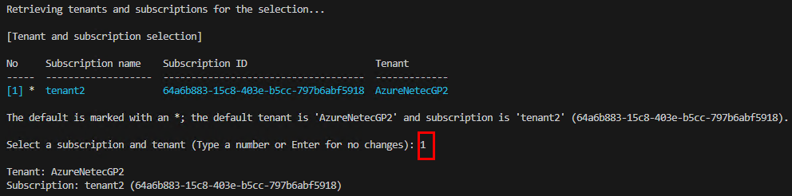
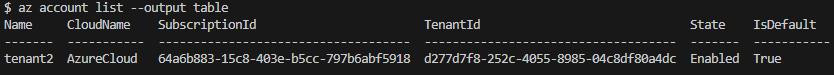
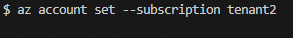
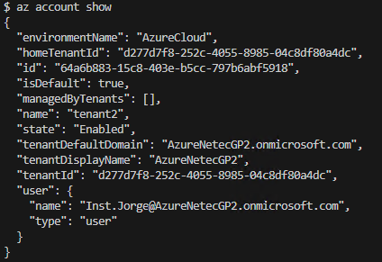
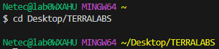
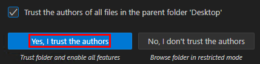
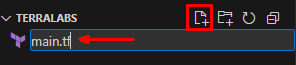
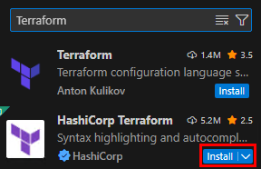

# Práctica 2: Autenticación del Proveedor Azure en Terraform

## Objetivo

Configurar la autenticación con el proveedor de Azure en Terraform utilizando Azure CLI y un archivo de configuración `main.tf`, para permitir el despliegue de recursos en la nube desde un entorno local en Windows con Visual Studio Code.

## Requisitos Previos

- Terraform instalado y funcional en Windows.
- Visual Studio Code instalado.
- Git Bash instalado y configurado como terminal por defecto en VS Code.
- Azure CLI instalado.
- Tener una suscripción activa en Azure.

## Duración aproximada

- 15 minutos

---

**[⬅️ Atrás](https://netec-mx.github.io/TRFRM-AZ/Capítulo2/lab1.html)** | **[Lista General](https://netec-mx.github.io/TRFRM-AZ/)** | **[Siguiente ➡️](https://netec-mx.github.io/TRFRM-AZ/Capítulo3/lab3.html)**

---

## Instrucciones

### Tarea 1. Autenticarse en Azure CLI

> Se usará el comando `az login` desde Git Bash para iniciar sesión en la cuenta de Azure, y se configurará la suscripción activa si hay más de una.

#### Tarea 1.1. Iniciar sesión en Azure

- **Paso 1.** Abre **Visual Studio Code** y abre una terminal integrada con Git Bash: `Terminal > New Terminal` o `CTRL + ñ`.

- **Paso 2.** Ejecuta el siguiente comando para iniciar sesión en Azure:

   ```bash
   az login
   ```

- **Paso 3.** Se abrirá una ventana del navegador para iniciar sesión. Una vez completado, la terminal mostrará información de la cuenta autenticada.

   **NOTA:** La autenticación debe de ser con el **usuario y contraseña** asignado al curso. **La suscripción puede ser diferente**

   **NOTA IMPORTANTE:** Es posible que al autenticarte te mande algun mensaje de error pero observa tu terminal para verificar que se haya autenticado correctamente como lo muestra la segunda imagen

   
   -
   


#### Tarea 1.2. Seleccionar la suscripción deseada

- **Paso 1.** Si tienes más de una suscripción, puedes verlas con:

   ```bash
   az account list --output table
   ```
   ---
   


- **Paso 2.** Luego, selecciona la suscripción activa ejecutando:

   **NOTA:** Sustituye el nombre de la suscipción por la del comando anterior, ejecutalo sin las comillas dobles.

   ```bash
   az account set --subscription "NOMBRE-DE-LA-SUSCRIPCIÓN"
   ```
   ---
   

- **Paso 3.** Verifica la suscripción activa:

   ```bash
   az account show
   ```
   ---
   

> **TAREA FINALIZADA**

**Resultado esperado:** Azure CLI autenticado correctamente y configurado con la suscripción correcta.

---

### Tarea 2. Crear archivo de configuración de proveedor `main.tf`

> En esta tarea se creará un directorio de proyecto y se escribirá un archivo `main.tf` que contiene la configuración mínima del proveedor `azurerm`.

#### Tarea 2.1. Crear estructura de proyecto

- **Paso 1.** En la terminal de Git Bash, usa la carpeta previamente creada para el proyecto llamada **TERRALABS**:

   **NOTA:** Si la carpeta `TERRALABS` no existe creala en el Escritorio.

   ```bash
   cd Desktop/TERRALABS
   ```
   ---
   **NOTA:** Si es necesario ajusta el nombre de la carpeta.

   

- **Paso 2.** Abre esta carpeta desde VS Code: **`File > Open Folder... > Selecciona Desktop y luego TERRALABS`** y confirma la ventana emergente.

   

#### Tarea 2.2. Crear y editar `main.tf`

- **Paso 1.** En el explorador de VS Code, crea un nuevo archivo llamado `main.tf`.

      

- **Paso 2.** Copia y pega el siguiente contenido:

   ```hcl
   terraform {
   required_providers {
      azurerm = {
         source  = "hashicorp/azurerm"
         version = "~> 3.0"
      }
   }

   required_version = ">= 1.5.0"
   }

   provider "azurerm" {
   features {}
   }
   ```

> **TAREA FINALIZADA**

**Resultado esperado:** Se habrá creado el archivo base de configuración de Terraform para trabajar con Azure.

---

### Tarea 3. Extensión de Terraform en VSC

> En esta tarea se instalará la extensión oficial de Terraform en Visual Studio Code para facilitar el desarrollo con soporte de sintaxis, autocompletado y validación en archivos `.tf`.

#### Tarea 3.1. Abrir el Marketplace de extensiones

- **Paso 1.** Da clic en el ícono de **Extensiones** del menú lateral izquierdo (o presiona `CTRL + SHIFT + X`).

#### Tarea 3.2. Buscar la extensión oficial

- **Paso 1.** En la barra de búsqueda escribe:

   ```
   Terraform
   ```

- **Paso 2.** Localiza la extensión llamada **“Terraform”** publicada por **HashiCorp**.

#### Tarea 3.3. Instalar la extensión

- **Paso 1.** Da clic en el botón **"Install"**.

      

- **Paso 2.** Confirma la ventana emergente clic en **Trust Publisher & Install**

- **Paso 3.** Espera a que finalice la instalación.

#### Tarea 3.4. Validar que funcione

- **Paso 1.** Abre tu archivo `main.tf`.

- **Paso 2.** Verifica que aparezca resaltado de sintaxis (colores) y que se activen sugerencias automáticas (`CTRL + SPACE`).

- **Paso 3.** Por el momento no ejecutamos nada mas.

> **TAREA FINALIZADA**

**Resultado esperado:** Visual Studio Code estará listo para trabajar con archivos Terraform de forma eficiente, con ayuda de resaltado de sintaxis, validación en tiempo real y autocompletado.

---

> **¡FELICIDADES HAZ COMPLETADO EL LABORATORIO 2!**

## Resultado Final

- Azure CLI autenticado correctamente en tu cuenta de Azure.
- Archivo `main.tf` configurado con el proveedor `azurerm`.
- Proyecto creado en una carpeta organizada.
- Visual Studio Code configurado como entorno de desarrollo para Terraform.

---

## Notas

- Esta práctica utiliza autenticación de sesión basada en `az login`, ideal para entornos de desarrollo.  
- Para entornos automatizados (CI/CD), se recomienda usar una autenticación mediante Service Principal: [Guía oficial aquí](https://registry.terraform.io/providers/hashicorp/azurerm/latest/docs/guides/service_principal_client_secret).

---

**[⬅️ Atrás](https://netec-mx.github.io/TRFRM-AZ/Capítulo2/lab1.html)** | **[Lista General](https://netec-mx.github.io/TRFRM-AZ/)** | **[Siguiente ➡️](https://netec-mx.github.io/TRFRM-AZ/Capítulo3/lab3.html)**