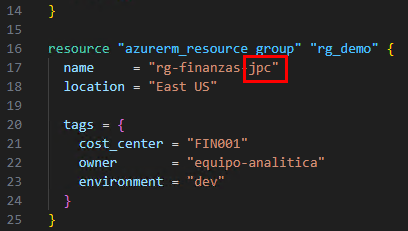
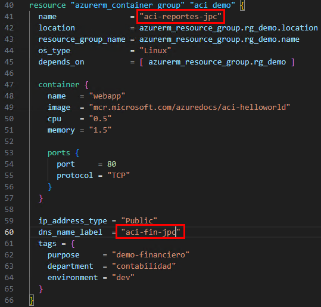

# Práctica 3: Definición de recursos en Terraform

## Objetivo

Definir tres recursos básicos en Azure con Terraform: un grupo de recursos, una red virtual y una instancia de contenedor. Todo se declarará en un solo archivo `main.tf`, personalizando los nombres de recursos con iniciales para evitar conflictos.

## Requisitos Previos

- Tener la carpeta `TERRALABS` y el archivo `main.tf` ya creado.
- El proveedor `azurerm` debe estar declarado correctamente en `main.tf`.
- Azure CLI debe estar autenticado (`az login`).

## Duración aproximada

- 15 minutos

---

**[⬅️ Atrás](https://netec-mx.github.io/TRFRM-AZ/Capítulo3/lab2.html)** | **[Lista General](https://netec-mx.github.io/TRFRM-AZ/)** | **[Siguiente ➡️](https://netec-mx.github.io/TRFRM-AZ/Capítulo4/lab4.html)**

---

## Instrucciones

### Tarea 1. Declarar el Grupo de Recursos

En esta tarea se agregará un bloque que define el grupo de recursos de Azure en el archivo `main.tf`. Cada estudiante debe usar sus **iniciales** para evitar conflictos en los nombres, siguiendo además una convención orientada a entornos financieros.

#### Tarea 1.1. Abrir el archivo `main.tf`

- **Paso 1.** Abre **Visual Studio Code**.

- **Paso 2.** Navega a la carpeta `TERRALABS`.

- **Paso 3.** Abre el archivo `main.tf`.

**NOTA:** Si ya completaste los pasos en laboratorios anteriores puedes avanzar a la siguiente tarea.

#### Tarea 1.2. Agregar el recurso `azurerm_resource_group`

- **Paso 4.** Al final del archivo `main.tf`, agrega este bloque. **Reemplaza `xxx` por tus iniciales**:

  ```hcl
  resource "azurerm_resource_group" "rg_demo" {
    name     = "rg-finanzas-xxx"
    location = "East US"

    tags = {
      cost_center = "FIN001"
      owner       = "equipo-analitica"
      environment = "dev"
    }
  }
  ```
  
  ---
  
    

> **Ejemplo:** si tus iniciales son `lmr`, el nombre será `rg-finanzas-lmr`.

> **TAREA FINALIZADA**

**Resultado esperado:** El grupo de recursos ha sido definido correctamente en `main.tf`, con un nombre personalizado y etiquetas relevantes para trazabilidad financiera.

---

### Tarea 2. Declarar la Red Virtual

En esta tarea se agregará la red virtual (`azurerm_virtual_network`) haciendo referencia al grupo de recursos definido anteriormente.

El nombre de la red virtual también deberá incluir tus iniciales y reservar un espacio IP no superpuesto.

#### Tarea 2.1. Agregar el recurso `azurerm_virtual_network`

- **Paso 5.** Justo después del bloque anterior, agrega este fragmento de código:

  **NOTA:** Cambia el valor del segundo octeto de la propiedad **`address_space`** usa un valor entre **1 y 254**. Pregunta al equipo si ese valor ya fue usado para evitar conflictos de redes.

  ```hcl
  resource "azurerm_virtual_network" "vnet_demo" {
    name                = "vnet-fin-xxx"
    address_space       = ["10.x.0.0/16"]
    location            = azurerm_resource_group.rg_demo.location
    resource_group_name = azurerm_resource_group.rg_demo.name
    depends_on          = [ azurerm_resource_group.rg_demo ]

    tags = {
      security_zone = "isolated"
      environment   = "dev"
    }
  }
  ```
  
  ---
  
   

> Asegúrate de usar las mismas iniciales que en el grupo de recursos.

> **TAREA FINALIZADA**

**Resultado esperado:** El archivo `main.tf` contiene los dos recursos declarados: un grupo de recursos y una red virtual básica con nombres únicos por estudiante.

---

### Tarea 3. Declarar una Instancia de Contenedor en Azure

En esta tarea se agregará una definición de recurso para desplegar una instancia de contenedor sencilla (basada en la imagen pública `mcr.microsoft.com/azuredocs/aci-helloworld`). **Este componente simula un entorno de prueba o dashboard financiero de desarrollo.**

El nombre del contenedor también deberá llevar tus iniciales.

#### Tarea 3.1. Agregar el recurso `azurerm_container_group`

- **Paso 6.** Al final del archivo `main.tf`, agrega el siguiente bloque. **Reemplaza `xxx` por tus iniciales**:

  ```hcl
  resource "azurerm_container_group" "aci_demo" {
    name                = "aci-reportes-xxx"
    location            = azurerm_resource_group.rg_demo.location
    resource_group_name = azurerm_resource_group.rg_demo.name
    os_type             = "Linux"

    container {
      name   = "webapp"
      image  = "mcr.microsoft.com/azuredocs/aci-helloworld"
      cpu    = "0.5"
      memory = "1.5"

      ports {
        port     = 80
        protocol = "TCP"
      }
    }

    ip_address_type = "Public"
    dns_name_label  = "aci-fin-xxx"
    tags = {
      purpose     = "demo-financiero"
      department  = "contabilidad"
      environment = "dev"
    }
  }
  ```
  
  ---
  
  

> Cambia también `aci-fin-xxx` por algo como `aci-fin-jpg` si tus iniciales son `jpg`.

> **TAREA FINALIZADA**

**Resultado esperado:** El archivo main.tf contendrá una definición de instancia de contenedor básica, personalizada y lista para desplegar, con etiquetas útiles para BI y monitoreo de costos.

---

> **¡FELICIDADES HAZ COMPLETADO EL LABORATORIO 3!**

## Resultado Final

- El archivo `main.tf` en la carpeta `TERRALABS` tiene definidos:
  - Un grupo de recursos personalizado con tags financieros.
  - Una red virtual aislada con naming estandarizado.
  - Una instancia de contenedor para pruebas.
- Todos los recursos están definidos pero **no se han desplegado aún**. La ejecución se hará en la próxima práctica.

---

## Notas

- Esta práctica no ejecuta `terraform init`, `plan` ni `apply`.
- No olvides personalizar todas las apariciones de `xxx` con tus iniciales.
- El valor `dns_name_label` en el contenedor debe ser **único globalmente** (puede causar error si se repite).
- Este ejercicio simula infraestructura base común en proyectos financieros de desarrollo.

---

**[⬅️ Atrás](https://netec-mx.github.io/TRFRM-AZ/Capítulo3/lab2.html)** | **[Lista General](https://netec-mx.github.io/TRFRM-AZ/)** | **[Siguiente ➡️](https://netec-mx.github.io/TRFRM-AZ/Capítulo4/lab4.html)**
