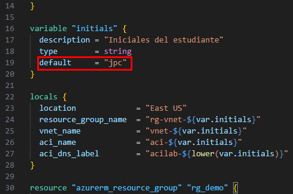
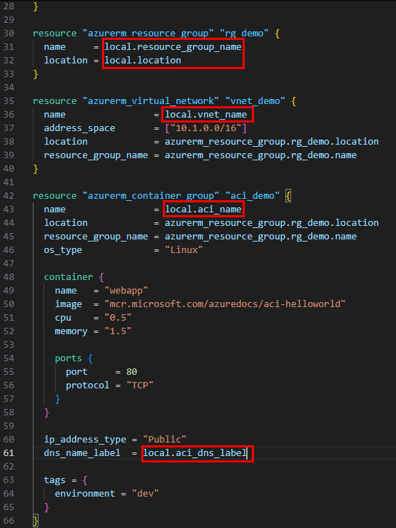

# Práctica 4: Creación y Asignación de Variables en Terraform

## Objetivo

Refactorizar el archivo `main.tf` utilizando variables locales definidas en el mismo archivo, para hacer el código más organizado y reutilizable. Se declaran variables directamente en `main.tf` y se usan para crear un grupo de recursos, una red virtual y una instancia de contenedor en Azure.

## Requisitos Previos

- Haber completado la Práctica 3 con los recursos definidos: `azurerm_resource_group`, `azurerm_virtual_network` y `azurerm_container_group`.
- Tener configurado el proveedor `azurerm` en el archivo `main.tf`.
- Estar autenticado con Azure CLI (`az login`).
- Tener la carpeta `TERRALABS` con el archivo `main.tf`.

## Duración aproximada

- 15 minutos

---

**[⬅️ Atrás](https://netec-mx.github.io/TRFRM-AZ/Capítulo3/lab3.html)** | **[Lista General](https://netec-mx.github.io/TRFRM-AZ/)** | **[Siguiente ➡️](https://netec-mx.github.io/TRFRM-AZ/Capítulo4/lab5.html)**

---

## Instrucciones

### Tarea 1. Declarar las variables dentro de `main.tf`

> En esta tarea se crearán las variables directamente al inicio del archivo `main.tf`, dentro de bloques `variable`, y se asignarán sus valores en el bloque `locals`.

#### Tarea 1.1. Abrir el archivo `main.tf`

- **Paso 1.** Abre **Visual Studio Code**.

- **Paso 2.** Navega a la carpeta `TERRALABS` y abre `main.tf`.

#### Tarea 1.2. Añadir bloques de variables y valores

- **Paso 1.** Copia este bloque al inicio del archivo, antes de los recursos y despues del proveedor declarado:

  ```hcl
  locals {
    location             = "East US"
    resource_group_name  = "rg-vnet-${var.initials}"
    vnet_name            = "vnet-${var.initials}"
    aci_name             = "aci-${var.initials}"
    aci_dns_label        = "acilab-${lower(var.initials)}"
  }
  ```

- **Paso 2.** Añade la variable `initials` con el valor de forma local, copia el siguiente codigo antes de la declaracion de `locals`. **`Sustituye el valor parametro default por tus iniciales`**:

  ```hcl
  variable "initials" {
    description = "Iniciales del estudiante"
    type        = string
    default     = "xxx"
  }
  ```
  ---
  

> **TAREA FINALIZADA**

**Resultado esperado:** Las variables están declaradas en el mismo archivo, y sus valores están definidos en el bloque `locals`.

---

### Tarea 2. Reescribir los recursos para usar las variables

> En esta tarea se actualizarán los recursos ya existentes en `main.tf` para que usen las variables y valores del bloque `locals`.

#### Tarea 2.1. Sustituir los valores fijos en los recursos

- **Paso 1.** Asegúrate de tener estos recursos definidos, ahora con variables:
  - **Opcion 1:** Puedes copiar y pegar todo el siguiente bloque ya tiene los cambios de las variables.
  - **Opcion 2:** Puedes buscar solo las lineas que necesitan las variables y cambiarlas, puees apoyarte de la imagen.

  ```hcl
  resource "azurerm_resource_group" "rg_demo" {
    name     = local.resource_group_name
    location = local.location
  }

  resource "azurerm_virtual_network" "vnet_demo" {
    name                = local.vnet_name
    address_space       = ["10.0.0.0/16"]
    location            = local.location
    resource_group_name = local.resource_group_name
  }

  resource "azurerm_container_group" "aci_demo" {
    name                = local.aci_name
    location            = local.location
    resource_group_name = local.resource_group_name
    os_type             = "Linux"

    container {
      name   = "webapp"
      image  = "mcr.microsoft.com/azuredocs/aci-helloworld"
      cpu    = "0.5"
      memory = "1.5"

      ports {
        port     = 80
        protocol = "TCP"
      }
    }

    ip_address_type = "public"
    dns_name_label  = local.aci_dns_label

    tags = {
      environment = "dev"
    }
  }
  ```
  ---
  

> **TAREA FINALIZADA**

**Resultado esperado:** Todos los recursos ahora utilizan las variables declaradas localmente.

---

> **¡FELICIDADES HAZ COMPLETADO EL LABORAOTRIO 4!**

## Resultado Final

- El archivo `main.tf` contiene:
  - Declaración de una variable `initials`.
  - Definición de valores con `locals`.
  - Todos los recursos (`RG`, `VNet`, `ACI`) usando estos valores.

Esto facilita la reutilización del código y permite crear múltiples ambientes solo cambiando el valor de `initials`.

---

## Notas

- Para ejecutar esta práctica, puedes pasar el valor así:

  ```bash
  terraform apply -var="initials=xxx"
  ```

- Alternativamente, puedes establecer un valor por defecto en la variable `initials` si no usarás `-var` en la terminal.
- Este enfoque simplifica el despliegue sin archivos externos como `variables.tf` o `tfvars`.

---

**[⬅️ Atrás](https://netec-mx.github.io/TRFRM-AZ/Capítulo3/lab3.html)** | **[Lista General](https://netec-mx.github.io/TRFRM-AZ/)** | **[Siguiente ➡️](https://netec-mx.github.io/TRFRM-AZ/Capítulo4/lab5.html)**