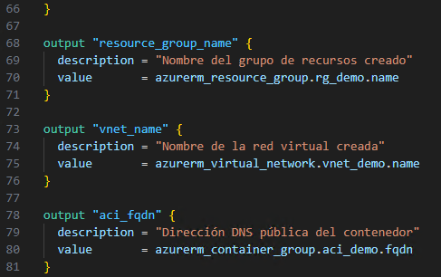

# Práctica 5: Creación de Outputs en Terraform

## Objetivo

Aprender a declarar y utilizar salidas (`output`) en Terraform para mostrar valores importantes al finalizar una ejecución, como el nombre del grupo de recursos, la dirección DNS del contenedor y el nombre de la red virtual. Las salidas se definirán directamente dentro del archivo `main.tf`.

## Requisitos Previos

- Haber completado la Práctica 4, donde ya se usan variables y `locals`.
- El archivo `main.tf` debe tener definidos los siguientes recursos:
  - `azurerm_resource_group`
  - `azurerm_virtual_network`
  - `azurerm_container_group`
- Tener autenticación activa con Azure CLI `az login`.

## Duración aproximada

- 10 minutos

---

**[⬅️ Atrás](https://netec-mx.github.io/TRFRM-AZ/Capítulo4/lab4.html)** | **[Lista General](https://netec-mx.github.io/TRFRM-AZ/)** | **[Siguiente ➡️](https://netec-mx.github.io/TRFRM-AZ/Capítulo5/lab6.html)**

---

## Instrucciones

### Tarea 1. Declarar salidas (`outputs`) en el archivo `main.tf`

> En esta tarea se añadirán bloques `output` al final del archivo `main.tf` para mostrar información clave al usuario.

#### Tarea 1.1. Abrir el archivo `main.tf`

- **Paso 1.** Abre Visual Studio Code.

- **Paso 2.** Abre la carpeta `TERRALABS`.

- **Paso 3.** Abre el archivo `main.tf`.

#### Tarea 1.2. Añadir los bloques `output` al final del archivo

- **Paso 1.** Desplázate al final del archivo `main.tf` y agrega los siguientes bloques:

  ```hcl
  output "resource_group_name" {
    description = "Nombre del grupo de recursos creado"
    value       = azurerm_resource_group.rg_demo.name
  }

  output "vnet_name" {
    description = "Nombre de la red virtual creada"
    value       = azurerm_virtual_network.vnet_demo.name
  }

  output "aci_fqdn" {
    description = "Dirección DNS pública del contenedor"
    value       = azurerm_container_group.aci_demo.fqdn
  }
  ```
  ---
  

> **TAREA FINALIZADA**

**Resultado esperado:** Al ejecutar `terraform apply`, Terraform mostrará en la terminal los valores del grupo de recursos, la VNet y la URL pública del contenedor. Por el momento aun no se ejecutara `terraform apply`.

---

> **¡FELICIDADES HAZ COMPLETADO EL LABORATORIO 5!**

## Resultado Final

- El archivo `main.tf` contiene bloques `output` correctamente definidos.
- Al aplicar la infraestructura, Terraform mostrará automáticamente:
  - El nombre del grupo de recursos creado.
  - El nombre de la red virtual.
  - El FQDN público del contenedor desplegado.

---

## Notas

> Esta solo es información de referencia, no se debe usar en la practica.

- Puedes ver los outputs sin aplicar cambios con:

  ```bash
  terraform output
  ```

  ```bash
  terraform plan
  ```

- También puedes consultar un output específico así (siempre y cuando ya este aplicada la infraestructura):

  ```bash
  terraform output aci_fqdn
  ```

- Estos valores son útiles para integrarlos con otros módulos o scripts automatizados.

---

**[⬅️ Atrás](https://netec-mx.github.io/TRFRM-AZ/Capítulo4/lab4.html)** | **[Lista General](https://netec-mx.github.io/TRFRM-AZ/)** | **[Siguiente ➡️](https://netec-mx.github.io/TRFRM-AZ/Capítulo5/lab6.html)**