# Práctica 6: Implementación del Ciclo de Vida con Terraform CLI

## Objetivo

Ejecutar el ciclo de vida completo de infraestructura usando Terraform CLI: inicialización, planificación, aplicación, consulta de salidas y destrucción.  
Se usará el archivo `main.tf` existente con recursos definidos y variables locales, tal como se organizó en prácticas anteriores.

## Requisitos Previos

- Tener la carpeta `TERRALABS` con el archivo `main.tf` configurado con:
  - Proveedor `azurerm`
  - Variables y `locals`
  - Recursos: `azurerm_resource_group`, `azurerm_virtual_network`, `azurerm_container_group`
  - Bloques `output`
- Tener configurada la variable `initials` con tus iniciales.
- Tener instalada la CLI de Terraform y Azure CLI (`az login` ejecutado).

## Duración aproximada

- 35 minutos

---

**[⬅️ Atrás](https://netec-mx.github.io/TRFRM-AZ/Capítulo4/lab5.html)** | **[Lista General](https://netec-mx.github.io/TRFRM-AZ/)** | **[Siguiente ➡️](https://netec-mx.github.io/TRFRM-AZ/Capítulo6/lab7.html)**

---

## Instrucciones

### Tarea 1. Inicializar el proyecto

> Este paso prepara Terraform para usar los proveedores declarados en el archivo `main.tf`.

#### Tarea 1.1. Ejecutar `terraform init`

- **Paso 1.** Aplica el siguiente comando en la terminal.

    ```bash
    terraform init
    ```
    ---
    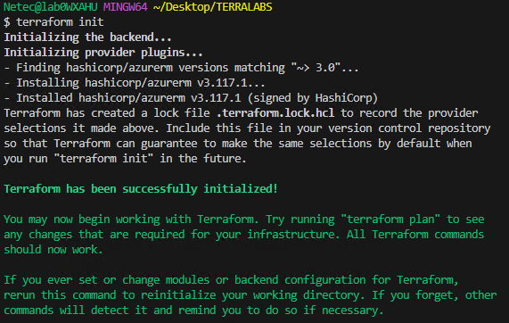

- **Paso 2.** Analiza la salida del comando.

> **TAREA FINALIZADA**

**Resultado esperado:** Terraform descarga el proveedor `azurerm` y configura el backend local. Verás el mensaje: `Terraform has been successfully initialized!`

---

### Tarea 2. Revisar el plan de ejecución

> Este paso permite revisar lo que Terraform va a crear sin aplicar cambios aún.

#### Tarea 2.1. Ejecutar `terraform plan`

- **Paso 1.** Aplica el siguiente comando en la terminal.

    ```bash
    terraform plan
    ```
    ---
    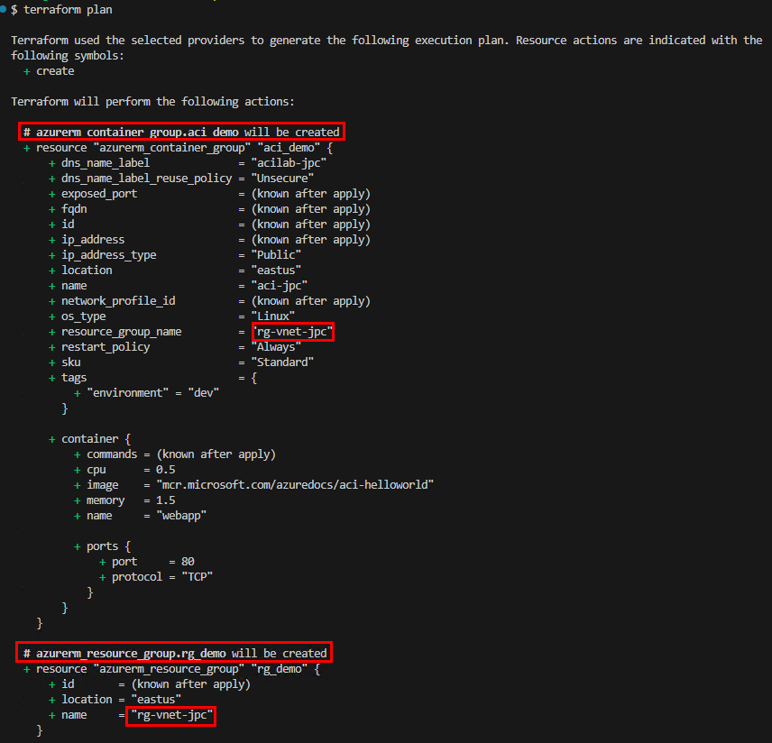
    -
    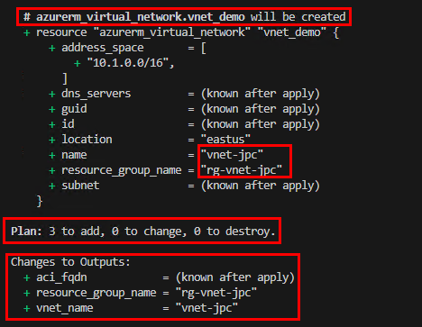

- **Paso 2.** Analiza la salida del comando.

- **Paso 3.** Aplica el siguiente comando en la terminal forzando el cambio del valor de la variable `initials`.

    > Reemplaza `xxx` por otras iniciales.

    ```bash
    terraform plan -var="initials=xxx"
    ```
    ---
    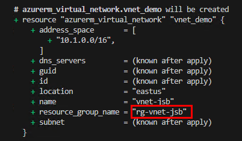

- **Paso 2.** Analiza la salida del comando nota como todos los nombres cambiaron

> **TAREA FINALIZADA**

**Resultado esperado:** La consola mostrará un resumen con los recursos que se van a crear. Ningún recurso se aplicará aún.

---

### Tarea 3. Aplicar los cambios

> Este paso crea los recursos en Azure según lo definido en el archivo `main.tf`.

#### Tarea 3.1. Ejecutar `terraform apply`.

- **Paso 1.** Aplica el siguiente comando en la terminal.

    ```bash
    terraform apply
    ```

- **Paso 2.** Analiza la salida del comando notaras que es similar al comando `terraform plan`.

- **Paso 3.** Cuanto hayas terminado de revisar el `apply`, confirma con `yes` cuando Terraform lo solicite.

    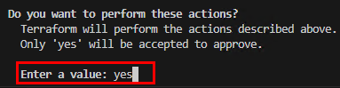

    **NOTA:** Tambien puedes usar el comando `terraform apply -auto-approve` es util cuando quieres omitir la confirmacio `yes`.

- **Paso 4.** Analiza los logs de la creacion de los recursos:

    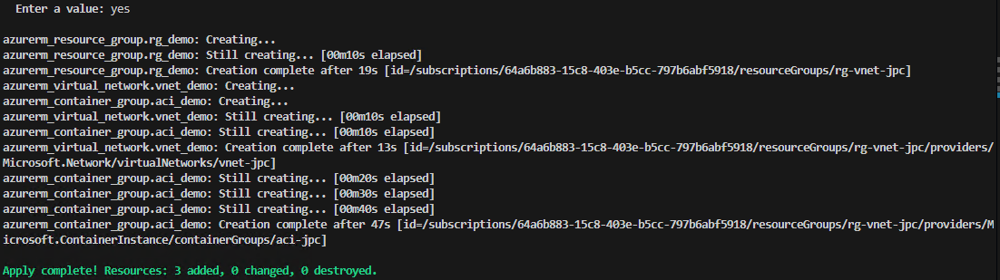

- **Paso 5.** Revisa los `outputs` generados por el `apply`.

    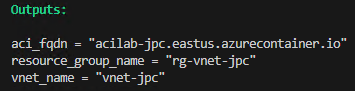

- **Paso 6.** Ahora copia el valor del output llamado `aci_fqdn` y pegalo en una pestaña de tu navegador.

    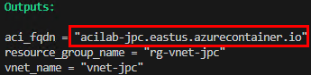
    -
    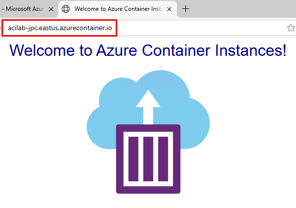


> **TAREA FINALIZADA**

**Resultado esperado:** Los recursos serán desplegados exitosamente en Azure. La consola mostrará los valores de salida definidos en los bloques `output`.

---

### Tarea 4. Consultar los outputs

> Puedes consultar las salidas después del despliegue sin volver a aplicar.

#### Tarea 4.1. Ejecutar `terraform output`

- **Paso 1.** Aplica el siguiente comando en la terminal.

    ```bash
    terraform output
    ```
    ---
    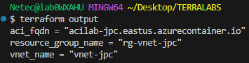


#### Tarea 4.2. Consultar una salida específica (opcional)

- **Paso 1.** Aplica el siguiente comando en la terminal.

    ```bash
    terraform output aci_fqdn
    ```
    ---
    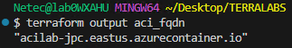

> **TAREA FINALIZADA**

**Resultado esperado:** Se mostrarán los nombres de los recursos y la dirección DNS del contenedor creado.

---

### Tarea 5. Destruir los recursos (opcional)

> Este paso elimina toda la infraestructura creada. Úsalo solo si deseas limpiar el entorno.

#### Tarea 5.1. Ejecutar `terraform destroy`

- **Paso 1.** Aplica el siguiente comando en la terminal.

    ```bash
    terraform destroy -auto-approve
    ```
    ---
    **Nota:** Las imagenes omiten los detalles de eliminación.

    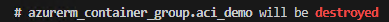
    -
    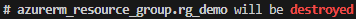
    -
    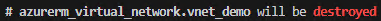
    -
    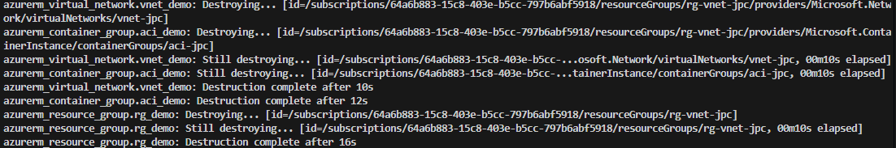

> **TAREA FINALIZADA**

**Resultado esperado:** Todos los recursos creados serán eliminados del grupo de recursos.

---

> **¡FELICIDADES HAZ COMPLETADO EL LABORAOTRIO 6!**

## Resultado Final

- Se habrán recorrido todas las fases del ciclo de vida:
  - `init`: inicialización
  - `plan`: vista previa
  - `apply`: aplicación de infraestructura
  - `output`: consulta de resultados
  - `destroy`: eliminación (opcional)
- Se experimento el flujo completo de trabajo de Terraform CLI con Azure.

---

## Notas

- Usa `terraform show` si deseas revisar el estado actual detallado.
- Puedes usar `terraform state list` para ver todos los recursos administrados.
- Ejecuta `terraform validate` para verificar errores de sintaxis en tus archivos antes de `plan`.

---

**[⬅️ Atrás](https://netec-mx.github.io/TRFRM-AZ/Capítulo4/lab5.html)** | **[Lista General](https://netec-mx.github.io/TRFRM-AZ/)** | **[Siguiente ➡️](https://netec-mx.github.io/TRFRM-AZ/Capítulo6/lab7.html)**