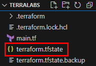
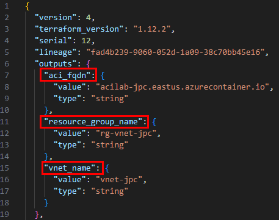
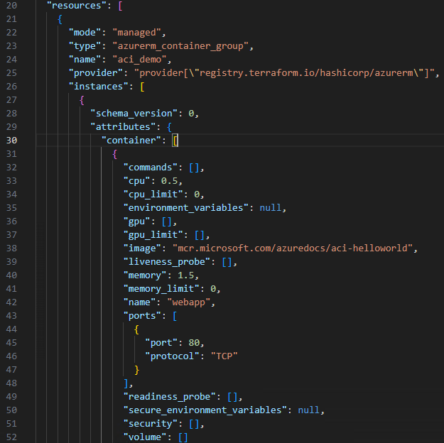
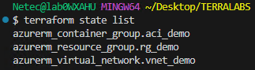
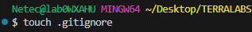
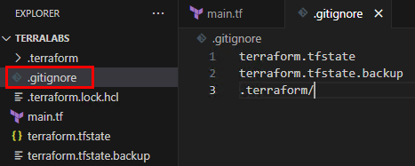

# Práctica 7: Leer e interpretar el archivo `.tfstate` generado

## Objetivo

Entender la función y estructura del archivo `terraform.tfstate`, el cual mantiene el estado actual de los recursos creados por Terraform. Esta práctica te permitirá visualizar, interpretar y comprender cómo Terraform rastrea los recursos administrados, aplicando buenas prácticas de seguridad y respaldo, fundamentales en ambientes financieros regulados.

## Requisitos Previos

- Haber aplicado previamente una configuración con `terraform apply`.
- Contar con el archivo `terraform.tfstate` generado dentro de la carpeta `TERRALABS`.
- Tener configurado un entorno funcional con Visual Studio Code.

## Duración aproximada

- 20 minutos

---

**[⬅️ Atrás](https://netec-mx.github.io/TRFRM-AZ/Capítulo5/lab6.html)** | **[Lista General](https://netec-mx.github.io/TRFRM-AZ/)** | **[Siguiente ➡️](https://netec-mx.github.io/TRFRM-AZ/Capítulo7/lab8.html)**

---

## Instrucciones

### Tarea 1. Ubicar el archivo `terraform.tfstate`

El archivo `.tfstate` se genera automáticamente después de ejecutar `terraform apply`.

#### Tarea 1.1. Verificar su existencia

- **Paso 1.** En Visual Studio Code, abre la carpeta `TERRALABS`.

- **Paso 2.** Confirma que exista un archivo llamado:

  ```
  terraform.tfstate
  ```
  
  ---
  
  

  > Este archivo es creado por Terraform para registrar el estado de la infraestructura que gestiona.

> **TAREA FINALIZADA**

**Resultado esperado:** El archivo `terraform.tfstate` está presente en la raíz de la carpeta del proyecto.

---

### Tarea 2. Visualizar el contenido del archivo

Aunque es un archivo en formato JSON, puede inspeccionarse directamente desde Visual Studio Code o desde la terminal.

#### Tarea 2.1. Leer el archivo con Visual Studio Code

- **Paso 1.** Abre `terraform.tfstate` desde el explorador de archivos de VS Code.

- **Paso 2.** Examina la estructura general: bloques `outputs`, `resources`.

  - **Outputs**

  

  - **Resources** La sección de recursos es de las mas extensas, la imagen representa una parte de lo que te aparecera en tu `tfstate`.

  
  
#### Tarea 2.2. Mostrar el estado con `terraform show`

- **Paso 3.** En la terminal, ejecuta el siguiente comando.

  ```bash
  terraform show
  ```

  > Este comando presenta el estado de los recursos en un formato legible, incluyendo nombres, tipos y propiedades.

- **Paso 4.** Puedes mejorar la salida con el siguiente comando.

  ```bash
  terraform state list
  ```
  
  ---
  
  

> **TAREA FINALIZADA**

**Resultado esperado:** Se podrá visualizar de forma estructurada el estado actual de los recursos gestionados por Terraform.

---

### Tarea 3. Recomendación: Seguridad y respaldo del archivo `.tfstate`

Esta tarea se enfoca en concientizar sobre la importancia de **proteger y respaldar correctamente** el archivo `terraform.tfstate`.

#### Tarea 3.1. Evitar exponer el archivo

- **Paso 1.** No subir el archivo `terraform.tfstate` a repositorios públicos (GitHub, GitLab, entre otros).

- **Paso 2.** Nunca compartirlo por correo o medios inseguros, ya que puede contener información sensible.

#### Tarea 3.2. Hacer respaldos frecuentes (si trabajas local)

- **Paso 3.** Copia manual del archivo antes de hacer cambios destructivos.

- **Paso 4.** Renombrar o duplicar con fecha:

  ```bash
  cp terraform.tfstate terraform.tfstate.backup.2025-0x-xx
  ```

#### Tarea 3.3. Ignorar en Git

- **Paso 5.** Crear el archivo `.gitignore` con sl siguiente comando.

  **NOTA:** Este es solo un ejemplo de buena practica, no se usa la herramienta git como repositorio en este curso.

  ```bash
  touch .gitignore
  ```
  
  ---
  
  

- **Paso 6.** En el archivo `.gitignore`, asegúrate de incluir:

  **NOTA:** Este es solo un ejemplo de buena practica, no se usa la herramienta git como repositorio en este curso.

  ```
  terraform.tfstate
  terraform.tfstate.backup
  .terraform/
  ```
  
  ---
  
  

> **TAREA FINALIZADA**

**Resultado esperado:** El archivo `.tfstate` está protegido contra exposición y respaldado correctamente antes de acciones críticas.

---

> **¡FELICIDADES HAZ COMPLETADO EL LABORATORIO 7!**

## Resultado Final

- Se comprendió:
  - Qué es y para qué sirve el archivo `terraform.tfstate`.
  - Cómo visualizar su contenido desde la terminal y desde VS Code.
  - Buenas prácticas para protegerlo, respaldarlo y evitar exposición no intencional.

---

## Notas

- Si el archivo `terraform.tfstate` se pierde o corrompe, Terraform no podrá hacer seguimiento de los recursos ya creados.
- Para trabajo en equipo o automatización, es recomendable usar **estado remoto** en Azure Storage.

---

**[⬅️ Atrás](https://netec-mx.github.io/TRFRM-AZ/Capítulo5/lab6.html)** | **[Lista General](https://netec-mx.github.io/TRFRM-AZ/)** | **[Siguiente ➡️](https://netec-mx.github.io/TRFRM-AZ/Capítulo7/lab8.html)**