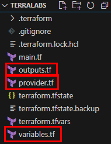
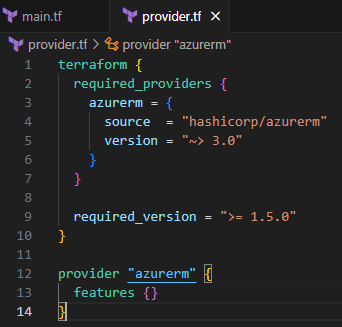
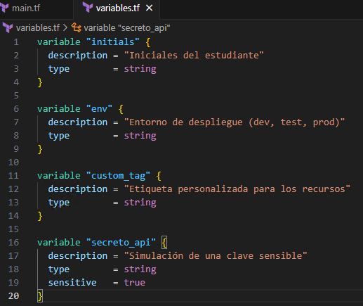
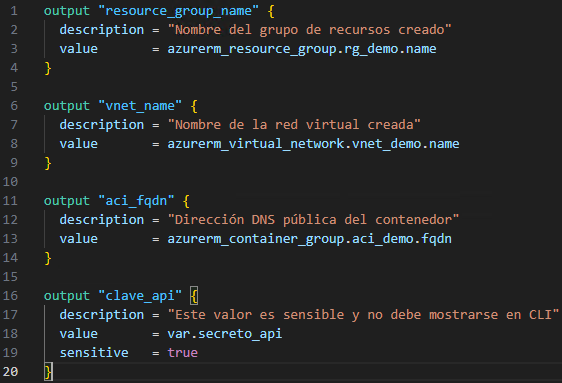
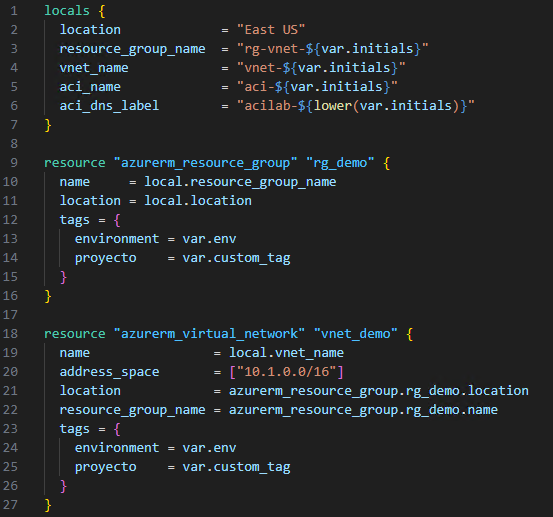
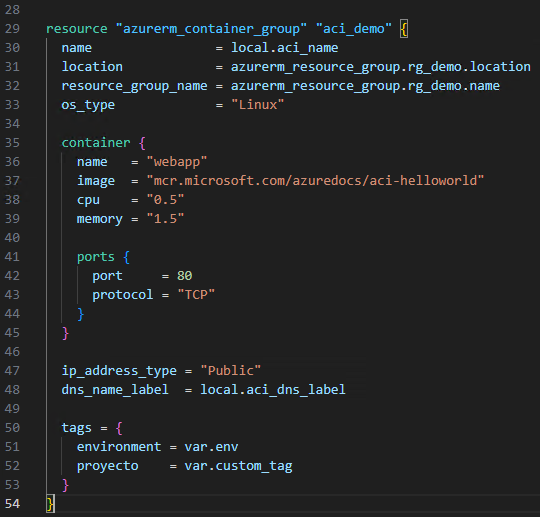
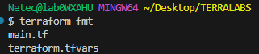
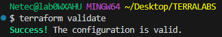
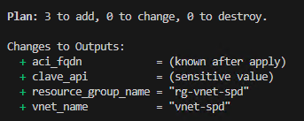
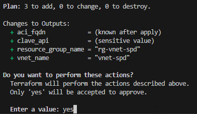

# Práctica 9: Estructurar un Proyecto Básico en Terraform

## Objetivo

Reorganizar el proyecto `TERRALABS` para mejorar la mantenibilidad, escalabilidad y reutilización del código.  
La configuración se dividirá en archivos separados: `main.tf`, `provider.tf`, `variables.tf`, `outputs.tf`, y `terraform.tfvars`, aplicando las mejores prácticas del ciclo profesional de Terraform.

## Requisitos Previos

- Haber completado las prácticas anteriores con recursos creados.
- Tener la carpeta `TERRALABS` operativa con `terraform init` ya ejecutado Opcional.
- Tener acceso a la CLI de Azure (`az login`).

## Duración aproximada

- 20 minutos

---

**[⬅️ Atrás](https://netec-mx.github.io/TRFRM-AZ/Capítulo7/lab8.html)** | **[Lista General](https://netec-mx.github.io/TRFRM-AZ/)** | **[Siguiente ➡️](https://netec-mx.github.io/TRFRM-AZ/Capítulo2/lab1.html)**

---

## Instrucciones

### Tarea 1. Crear estructura de archivos organizada 

> Se crearán archivos separados para definir cada parte lógica del proyecto.

#### Tarea 1.1. Creación de los archivos

- **Paso 1.** En Visual Studio Code dentro de `TERRALABS`, asegúrate de tener los siguientes archivos adicionales a `main.tf` y `terraform.tfvars`:

    ```
    provider.tf
    variables.tf
    outputs.tf
    ```
    ---
    

> **TAREA FINALIZADA**

**Resultado esperado:** Estructura de proyecto organizada con archivos separados por función.

---

### Tarea 2. Mover el proveedor a `provider.tf`

> Aquí colocaremos la definición del proveedor `azurerm` y la versión mínima requerida de Terraform.

#### Tarea 2.1. Definir el archivo `provider.tf`.

- **Paso 1.** En `main.tf`, identifica la seccion de provider **cortala** y pegala en el archivo `provider.tf`:

    **NOTA:** Asegurate que la definicion de provider ya no exista en el archivo `main.tf`

    ```hcl
    terraform {
    required_providers {
        azurerm = {
        source  = "hashicorp/azurerm"
        version = "~> 3.0"
        }
    }

    required_version = ">= 1.5.0"
    }

    provider "azurerm" {
      features {}
    }
    ```
    ---
    
    
> **TAREA FINALIZADA**

**Resultado esperado:** `provider.tf` contiene la configuración del proveedor y versiones.

---

### Tarea 3. Mover variables a `variables.tf`

> Todas las variables utilizadas deben definirse en este archivo.

#### Tarea 3.1. Definir el archivo `variables.tf`.

- **Paso 1.** En `main.tf`, identifica la seccion de variables **cortala** y pegala en el archivo `variables.tf`:

    **NOTA:** Asegurate que las variables ya no existan en el archivo `main.tf`, solo debe quedarse `locals` y `recursos`.

    ```hcl
    variable "initials" {
    description = "Iniciales del estudiante"
    type        = string
    }

    variable "env" {
    description = "Entorno de despliegue (dev, test, prod)"
    type        = string
    }

    variable "custom_tag" {
    description = "Etiqueta personalizada para los recursos"
    type        = string
    }

    variable "secreto_api" {
    description = "Simulación de una clave sensible"
    type        = string
    sensitive   = true
    }
    ```
    ---
    

> **TAREA FINALIZADA**

**Resultado esperado:** Todas las variables están correctamente separadas del resto de la lógica.

---

### Tarea 4. Mover outputs a `outputs.tf`

> Aquí irán los bloques `output`.

#### Tarea 4.1. Definir el archivo `outputs.tf`.

- **Paso 1.** En `main.tf`, identifica la seccion de outputs **cortala** y pegala en el archivo `outputs.tf`:

    **NOTA:** Asegurate que los outputs ya no existan en el archivo `main.tf`, solo debe quedarse `locals` y `recursos`.

    ```hcl
    output "resource_group_name" {
        description = "Nombre del grupo de recursos creado"
        value       = azurerm_resource_group.rg_demo.name
    }

    output "vnet_name" {
        description = "Nombre de la red virtual creada"
        value       = azurerm_virtual_network.vnet_demo.name
    }

    output "aci_fqdn" {
        description = "Dirección DNS pública del contenedor"
        value       = azurerm_container_group.aci_demo.fqdn
    }

    output "clave_api" {
        description = "Este valor es sensible"
        value       = var.secreto_api
        sensitive   = true
    }
    ```
    ---
    

> **TAREA FINALIZADA**

**Resultado esperado:** Todos los outputs están centralizados.

---

### Tarea 5. Dejar solo locals y recursos en `main.tf`

> Este archivo queda únicamente con la definición de locals y los recursos (grupo de recursos, red virtual, contenedor).

#### Tarea 5.1. Definir el archivo `main.tf`.

- **Paso 1.** Solo debera contener `locals` y el resto de los `recursos`.

    ```hcl
    locals {
      location            = "East US"
      resource_group_name = "rg-vnet-${var.initials}"
      vnet_name           = "vnet-${var.initials}"
      aci_name            = "aci-${var.initials}"
      aci_dns_label       = "acilab-${lower(var.initials)}"
    }

    resource "azurerm_resource_group" "rg_demo" {
      name     = local.resource_group_name
      location = local.location

      tags = {
          environment = var.env
          proyecto    = var.custom_tag
      }
    }

    resource "azurerm_virtual_network" "vnet_demo" {
      name                = local.vnet_name
      location            = local.location
      resource_group_name = azurerm_resource_group.rg_demo.name
      address_space       = ["10.x.0.0/16"]

      tags = {
          environment = var.env
          proyecto    = var.custom_tag
      }
    }

    resource "azurerm_container_group" "aci_demo" {
      name                = local.aci_name
      location            = local.location
      resource_group_name = azurerm_resource_group.rg_demo.name
      os_type             = "Linux"
      ip_address_type     = "public"
      dns_name_label      = local.aci_dns_label

    container {
        name   = "nginx"
        image  = "nginx"
        cpu    = 0.5
        memory = 1.5

        ports {
        port     = 80
        protocol = "TCP"
        }
    }

    tags = {
        environment = var.env
        proyecto    = var.custom_tag
    }
    }
    ```
    ---
    
    ---
    


> **TAREA FINALIZADA**

**Resultado esperado:** `main.tf` contiene solo lógica de locals y recursos.

---

### Tarea 6. Confirmar ejecución con estructura modular

> Verificamos que Terraform reconoce la nueva estructura.

#### Tarea 6.1. Ejecuta en la terminal:

- **Paso 1.** Ejecuta el siguiente comando para reformatear los archivos.

    ```bash
    terraform fmt
    ```
    ---
    

- **Paso 2.** Ejecuta el siguiente comando para validar sintaxis.
    
    ```bash
    terraform validate
    ```
    ---
    

- **Paso 3.** Ejecuta el siguiente comando.

    ```bash
    terraform plan
    ```
    ---
    

- **Paso 4.** Ejecuta el siguiente comando.

    ```bash
    terraform apply
    ```
    ---
    


> **TAREA FINALIZADA**

**Resultado esperado:** Terraform se ejecuta correctamente con los archivos organizados.

---

> **¡FELICIDADES HAZ COMPLETO EL LABORAOTRIO 9!**

## Resultado Final

Tu estructura final del proyecto será:

```
TERRALABS/
├── main.tf              # Recursos
├── provider.tf          # Proveedor y versiones
├── variables.tf         # Definiciones de variables
├── outputs.tf           # Salidas
├── terraform.tfvars     # Valores de variables
```

El proyecto queda listo para ser mantenido a escala y en equipo, siguiendo buenas prácticas reales.

---

## Notas

- Puedes actualizar el archivo `.gitignore` con:

    ```
    .terraform/
    terraform.tfstate*
    terraform.tfvars
    ```

- La modularización es el primer paso para escalar a proyectos más grandes usando módulos reutilizables.

---

**[⬅️ Atrás](https://netec-mx.github.io/TRFRM-AZ/Capítulo7/lab8.html)** | **[Lista General](https://netec-mx.github.io/TRFRM-AZ/)** | **[Siguiente ➡️](https://netec-mx.github.io/TRFRM-AZ/Capítulo2/lab1.html)**