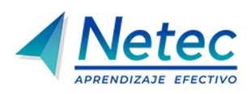

#  

**Plataforma de Laboratorios**

Bienvenido a la **Plataforma de Laboratorios** del curso **Terraform en Azure Essentials**. Aquí podrás explorar diferentes tecnologías a través de prácticas guiadas. ¡Desarrolla tus habilidades y lleva tus conocimientos al siguiente nivel!

---

## 🌟 **Lista de Laboratorios - Terraform en Azure Essentials**

Cada uno de estos laboratorios está diseñado para ofrecerte una experiencia práctica. Haz clic en los enlaces para comenzar.

01. **[Práctica 1: Instalación y Verificación de Terraform en Windows para Azure](/Capítulo2/lab1.md)**
      - **Descripción**: Instalación de Terraform en Windows y preparación del entorno para usar Azure CLI.
      - ⏱️ **Duración estimada**: 25 minutos

02. **[Práctica 2: Autenticación del Proveedor Azure en Terraform](/Capítulo3/lab2.md)**
      - **Descripción**: Autenticación del proveedor Azure en Terraform usando Azure CLI y configuración en `main.tf`.
      - ⏱️ **Duración estimada**: 15 minutos

03. **[Práctica 3: Definición de recursos en Terraform](/Capítulo3/lab3.md)**
      - **Descripción**: Definición de recursos básicos en Azure desde main.tf: grupo, red virtual e instancia de contenedor.
      - ⏱️ **Duración estimada**: 15 minutos

04. **[Práctica 4: Creación y Asignación de Variables en Terraform](/Capítulo4/lab4.md)**
      - **Descripción**: Uso de variables locales en `main.tf` para organizar y reutilizar la definición de recursos en Azure.
      - ⏱️ **Duración estimada**: 15 minutos

05. **[Práctica 5: Creación de Outputs en Terraform](/Capítulo4/lab5.md)**
      - **Descripción**: Declaración de salidas `(output)` en main.tf para mostrar información clave tras la ejecución.
      - ⏱️ **Duración estimada**: 10 minutos

06. **[Práctica 6: Implementación del Ciclo de Vida con Terraform CLI](/Capítulo5/lab6.md)**
      - **Descripción**: Uso de Terraform CLI para ejecutar el ciclo de vida completo: init, plan, apply, output y destroy.
      - ⏱️ **Duración estimada**: 35 minutos

07. **[Práctica 7: Leer e interpretar el archivo `.tfstate` generado](/Capítulo6/lab7.md)**
      - **Descripción**: Comprensión del archivo `terraform.tfstate` y cómo Terraform usa su contenido para rastrear recursos.
      - ⏱️ **Duración estimada**: 20 minutos

08. **[Práctica 8: Crear archivo `.tfvars` con claves y etiqueta sensible](/Capítulo7/lab8.md)**
      - **Descripción**: Uso de `.tfvars` para separar valores de variables y manejar datos sensibles de forma segura.
      - ⏱️ **Duración estimada**: 20 minutos

09. **[Práctica 9: Estructurar un Proyecto Básico en Terraform](/Capítulo8/lab9.md)**
      - **Descripción**: Estructuración del proyecto en archivos separados para aplicar buenas prácticas y facilitar su mantenimiento.
      - ⏱️ **Duración estimada**: 20 minutos

**[Recomendaciones: Ejemplos adicionales de Proyectos en Terraform y Buenas Prácticas de Organización](/notas.md)**

---

## 📬 **Contacto y Más Información**

Si tienes alguna pregunta o necesitas más detalles, no dudes en [contactarnos](mailto:soporte@netec.com). También puedes encontrar más recursos en nuestra página de [Netec](https://netec.com).

---

¡Gracias por visitar nuestra plataforma! No olvides revisar todos los laboratorios y comenzar tu viaje de aprendizaje hoy mismo.
